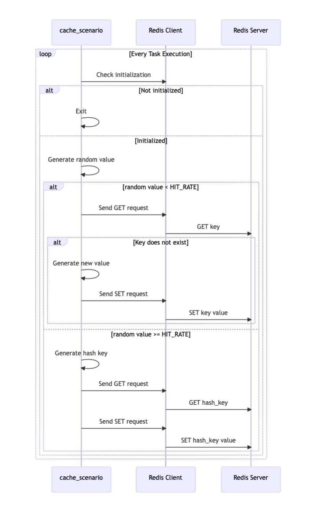

# locust-cache-benchmark

The load testing tool described here builds on the foundational
insights provided by the native
[redis-benchmark][redis-bench] tool,
which is an excellent utility for measuring
[Redis](https://redis.io/) & [Valkey](https://valkey.io/)
throughput and latency under controlled conditions.
While [redis-benchmark][redis-bench]
excels at providing raw performance metrics for
[Redis](https://redis.io/),
this custom solution is designed to extend those capabilities
for capacity planning in production-like environments.

By using [Locust](https://locust.io/), this tool simulates
realistic workloads with adjustable parameters such as
cache hit rates, request rates (get/set req/sec), TTL,
and cache sizes. It replicates both cache hit and miss
scenarios using random keys, offering a more dynamic
testing environment. Additionally, retry logic ensures
robustness against temporary errors in the
[Redis](https://redis.io/) & [Valkey](https://valkey.io/)
cluster, making it suitable for testing under varying
conditions.

This approach complements [redis-benchmark][redis-bench]
by focusing on scenarios that mimic real-world application
behaviors. Test results, including total requests,
cache hits, and hit rates, provide actionable insights
for capacity planning and performance optimization in
[Redis](https://redis.io/) & [Valkey](https://valkey.io/)
deployments.

## Features

- Executes load tests on
  [Redis](https://redis.io/) & [Valkey](https://valkey.io/)
  clusters
- Allows configuration of parameters such as
  cache hit rate, value size, and TTL
- Displays test results in real-time
- Supports distributed load testing with
  Locust master/worker mode
- Supports [OpenTelemetry](https://opentelemetry.io/)
  tracing for Redis operations via auto-instrumentation
- Supports [OpenTelemetry](https://opentelemetry.io/)
  native metrics for Redis via redis-py observability
  (command duration, connection pool, error counts)

## Supported Environments

- [Redis](https://redis.io/) Cluster
- [Redis](https://redis.io/) Standalone
- [Valkey](https://valkey.io/) Cluster
- [Valkey](https://valkey.io/) Standalone

The above cache service is supported.

## Processing Flow

```mermaid

```



## Attention

- **About Scenario Execution Time**
  - It is recommended to test at least twice as long
    as the TTL of the data (SET) being stored
    on the scenario.
    - It may not be possible to reproduce the assumed
      situation unless the cache deletion by TTL is
      performed at least once in the scenario.
      (except without ttl).
- **Role of locust-cache-benchmark**
  - This tool is designed to simulate request load
    (get/set req/sec), cache hit rate, cache size,
    and TTL as expected in a production Redis
    environment. By applying production-like load
    over a specific period, it helps in capacity
    planning and performance evaluation of Redis.
    - However, to maintain a consistent cache hit rate,
      this tool sends set requests for the portion of
      requests outside the cache hit rate
      (100% - cache hit rate). As a result, the number
      of cached items may exceed what is typically
      expected in the actual production environment.
      Please take this characteristic into account
      when interpreting test results.
- **Memory usage and eviction policies**
  - The increased number of cached items may lead to
    higher memory usage than expected. Monitor Redis
    memory consumption and ensure eviction policies
    are configured appropriately.
- **About request volume**
  - In the creator's environment, the volume of
    requests is known to be about 700 req/sec more
    than the overall expected capacity.
    (Cache hit rate is the same) Therefore, it is
    required to take this into account before
    implementation.
    - In the author's environment, I dropped
      700 req/sec and set up connection, and it
      executed as expected.
- **About this tool**
  - This tool uses the init and loadtest commands
    to achieve load testing. This tool can be
    executed using workflow, but a dependency between
    the init and loadtest commands is necessary
    because if the init is done on a job running
    in parallel, a useless set for redis will be
    executed.

## Installation

### Local Machine (Poetry)

```sh
pip install poetry
poetry install
```

### Local Machine (pip)

```sh
pip install locust-cache-benchmark
```

### Container Image

```sh
docker pull ghcr.io/s-mishina/locust-redis-benchmark:latest
```

## Usage

### Commands

This tool provides the following subcommands:

| Command                              | Description                                                      |
| ------------------------------------ | ---------------------------------------------------------------- |
| `init redis`                         | Initialize Redis cluster with test keys                          |
| `init valkey`                        | Initialize Valkey cluster with test keys                         |
| `init redis-standalone`              | Initialize standalone Redis with test keys                       |
| `init valkey-standalone`             | Initialize standalone Valkey with test keys                      |
| `loadtest local redis`               | Run a local load test on Redis cluster                           |
| `loadtest local valkey`              | Run a local load test on Valkey cluster                          |
| `loadtest local redis-standalone`    | Run a local load test on standalone Redis                        |
| `loadtest local valkey-standalone`   | Run a local load test on standalone Valkey                       |
| `loadtest cluster redis`             | Run a distributed (master/worker) load test on Redis cluster     |
| `loadtest cluster valkey`            | Run a distributed (master/worker) load test on Valkey cluster    |
| `loadtest cluster redis-standalone`  | Run a distributed (master/worker) load test on standalone Redis  |
| `loadtest cluster valkey-standalone` | Run a distributed (master/worker) load test on standalone Valkey |

### Local Machine

To initialize a Redis cluster:

```sh
locust_cache_benchmark init redis \
  -f <hostname> -p <port>
```

To execute a local load test on a Redis cluster:

```sh
locust_cache_benchmark loadtest local redis \
  -f <hostname> -p <port> \
  -r <hit_rate> -d <duration> \
  -c <connections> -n <spawn_rate> \
  -k <value_size> -t <ttl> \
  -rr <request_rate>
```

To initialize a standalone Redis:

```sh
locust_cache_benchmark init redis-standalone \
  -f <hostname> -p <port>
```

To initialize a standalone Valkey:

```sh
locust_cache_benchmark init valkey-standalone \
  -f <hostname> -p <port>
```

To execute a local load test on a standalone Redis:

```sh
locust_cache_benchmark loadtest local redis-standalone \
  -f <hostname> -p <port> \
  -r <hit_rate> -d <duration> \
  -c <connections> -n <spawn_rate> \
  -k <value_size> -t <ttl> \
  -rr <request_rate>
```

To execute a local load test on a standalone Valkey:

```sh
locust_cache_benchmark loadtest local valkey-standalone \
  -f <hostname> -p <port> \
  -r <hit_rate> -d <duration> \
  -c <connections> -n <spawn_rate> \
  -k <value_size> -t <ttl> \
  -rr <request_rate>
```

To execute a distributed load test (master):

```sh
locust_cache_benchmark loadtest cluster redis \
  -f <hostname> -p <port> \
  -r <hit_rate> -d <duration> \
  -c <connections> -n <spawn_rate> \
  -k <value_size> -t <ttl> \
  -rr <request_rate> \
  --cluster-mode master \
  --master-bind-host 0.0.0.0 \
  --master-bind-port 5557 \
  --num-workers 3
```

To execute a distributed load test (worker):

```sh
locust_cache_benchmark loadtest cluster redis \
  -f <hostname> -p <port> \
  --cluster-mode worker \
  --master-bind-host <master_host> \
  --master-bind-port 5557
```

To execute a distributed load test on standalone Redis (master):

```sh
locust_cache_benchmark loadtest cluster redis-standalone \
  -f <hostname> -p <port> \
  -r <hit_rate> -d <duration> \
  -c <connections> -n <spawn_rate> \
  -k <value_size> -t <ttl> \
  -rr <request_rate> \
  --cluster-mode master \
  --master-bind-host 0.0.0.0 \
  --master-bind-port 5557 \
  --num-workers 3
```

To execute a distributed load test on standalone Redis (worker):

```sh
locust_cache_benchmark loadtest cluster redis-standalone \
  -f <hostname> -p <port> \
  --cluster-mode worker \
  --master-bind-host <master_host> \
  --master-bind-port 5557
```

### Container Usage

To initialize a Redis cluster:

```sh
docker run --rm -it \
  ghcr.io/s-mishina/locust-redis-benchmark:latest \
  locust_cache_benchmark init redis \
  -f <hostname> -p <port>
```

To execute a load test on a Redis cluster:

```sh
docker run --rm -it \
  ghcr.io/s-mishina/locust-redis-benchmark:latest \
  locust_cache_benchmark loadtest local redis \
  -f <hostname> -p <port> \
  -r <hit_rate> -d <duration> \
  -c <connections> -n <spawn_rate> \
  -k <value_size> -t <ttl> \
  -rr <request_rate>
```

To initialize a standalone Redis via container:

```sh
docker run --rm -it \
  ghcr.io/s-mishina/locust-redis-benchmark:latest \
  locust_cache_benchmark init redis-standalone \
  -f <hostname> -p <port>
```

To execute a load test on a standalone Redis via container:

```sh
docker run --rm -it \
  ghcr.io/s-mishina/locust-redis-benchmark:latest \
  locust_cache_benchmark loadtest local redis-standalone \
  -f <hostname> -p <port> \
  -r <hit_rate> -d <duration> \
  -c <connections> -n <spawn_rate> \
  -k <value_size> -t <ttl> \
  -rr <request_rate>
```

### Kubernetes

A sample Kubernetes Job manifest is available at
[sample-manifest/job.yaml](./sample-manifest/job.yaml).

## Parameters

### Common Parameters

| Parameter            | Short | Type  | Default     | Description                                                 |
| -------------------- | ----- | ----- | ----------- | ----------------------------------------------------------- |
| `--fqdn`             | `-f`  | str   | `localhost` | Hostname of the cache server                                |
| `--port`             | `-p`  | int   | `6379`      | Port of the cache server                                    |
| `--ssl`              | `-x`  | str   | `False`     | Use SSL for the connection                                  |
| `--query-timeout`    | `-q`  | int   | `1`         | Query timeout in seconds                                    |
| `--hit-rate`         | `-r`  | float | `0.5`       | Cache hit rate (0.0 - 1.0)                                  |
| `--duration`         | `-d`  | int   | `60`        | Test duration in seconds                                    |
| `--connections`      | `-c`  | int   | `1`         | Number of concurrent users                                  |
| `--spawn_rate`       | `-n`  | int   | `1`         | User spawn rate per second                                  |
| `--value-size`       | `-k`  | int   | `1`         | Value size in KB                                            |
| `--ttl`              | `-t`  | int   | `60`        | Time-to-live for keys in seconds                            |
| `--connections-pool` | `-l`  | int   | `10`        | Connection pool size per cluster node                       |
| `--request-rate`     | `-rr` | float | `1.0`       | Request rate per user per second (uses constant_throughput) |
| `--retry-count`      | `-rc` | int   | `3`         | Number of retries on failure                                |
| `--retry-wait`       | `-rw` | int   | `2`         | Maximum wait time (cap) for exponential backoff in seconds  |
| `--set-keys`         | `-s`  | int   | `1000`      | Number of keys to set (init only)                           |

### OpenTelemetry Parameters

| Parameter                  | Type | Default                  | Description                                               |
| -------------------------- | ---- | ------------------------ | --------------------------------------------------------- |
| `--otel-tracing-enabled`   | str  | `false`                  | Enable OpenTelemetry tracing                              |
| `--otel-metrics-enabled`   | str  | `false`                  | Enable redis-py native OpenTelemetry metrics (Redis only) |
| `--otel-exporter-endpoint` | str  | `http://localhost:4317`  | OTLP gRPC exporter endpoint                               |
| `--otel-service-name`      | str  | `locust-cache-benchmark` | OpenTelemetry service name                                |

### Distributed Mode Parameters

| Parameter            | Short  | Type | Default     | Description                     |
| -------------------- | ------ | ---- | ----------- | ------------------------------- |
| `--cluster-mode`     | `-cm`  | str  | `None`      | `master` or `worker`            |
| `--master-bind-host` | `-mbh` | str  | `127.0.0.1` | Master node hostname            |
| `--master-bind-port` | `-mbp` | int  | `5557`      | Master node port                |
| `--num-workers`      | `-nw`  | int  | `1`         | Number of workers (master only) |

## Tips

### Cloud vendor metrics delay

If you are using a monitoring tool (e.g., datadog),
you can enable redis integration to speed up the
data acquisition time by running the redis command
to acquire the data.

### OpenTelemetry tracing

This tool supports
[OpenTelemetry](https://opentelemetry.io/) tracing
for Redis operations. When enabled, every Redis
command (GET, SET, etc.) automatically generates
a span via `opentelemetry-instrumentation-redis`.

To enable tracing, pass `--otel-tracing-enabled true`
along with the exporter endpoint:

```sh
locust_cache_benchmark loadtest local redis \
  -f <hostname> -p <port> \
  -r <hit_rate> -d <duration> \
  -c <connections> -n <spawn_rate> \
  -k <value_size> -t <ttl> \
  -rr <request_rate> \
  --otel-tracing-enabled true \
  --otel-exporter-endpoint http://localhost:4317 \
  --otel-service-name my-benchmark
```

Spans are exported via OTLP gRPC to an
[OpenTelemetry Collector](https://opentelemetry.io/docs/collector/),
which can then forward them to backends such as
Jaeger, Tempo, or convert them to metrics via
the `spanmetrics` connector for Prometheus.

> **Note:** For Redis, both auto-instrumentation
> (`RedisInstrumentor`) and manual spans are active.
> For Valkey, manual spans are used since
> `RedisInstrumentor` does not instrument the
> valkey-py client.

### OpenTelemetry native metrics (Redis only)

In addition to tracing, this tool supports
redis-py v7.2 native
[OpenTelemetry](https://opentelemetry.io/) metrics
via the `redis.observability` module.
When enabled, the following metrics are automatically
collected and exported via OTLP gRPC:

| Metric name                        | Type      | Description              |
| ---------------------------------- | --------- | ------------------------ |
| `db.client.operation.duration`     | Histogram | Command execution time   |
| `db.client.connection.create_time` | Histogram | Connection creation time |
| `db.client.connection.count`       | Gauge     | Current connection count |
| `redis.client.errors`              | Counter   | Error count              |

To enable metrics, pass `--otel-metrics-enabled true`:

```sh
locust_cache_benchmark loadtest local redis \
  -f <hostname> -p <port> \
  -r <hit_rate> -d <duration> \
  -c <connections> -n <spawn_rate> \
  -k <value_size> -t <ttl> \
  -rr <request_rate> \
  --otel-metrics-enabled true \
  --otel-exporter-endpoint http://localhost:4317 \
  --otel-service-name my-benchmark
```

Tracing and metrics can be enabled independently
or together:

```sh
  --otel-tracing-enabled true \
  --otel-metrics-enabled true
```

> **Note:** Native metrics are only supported for
> Redis backends (`redis`, `redis_cluster`).
> When using Valkey backends, the metrics flag is
> automatically skipped with a warning log.

[redis-bench]: https://redis.io/docs/latest/operate/oss_and_stack/management/optimization/benchmarks/
